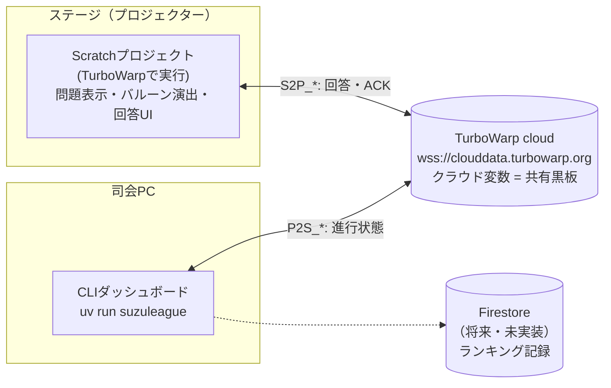
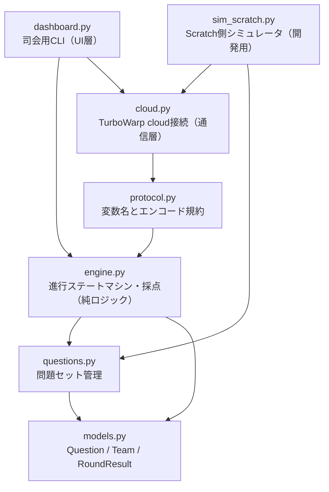
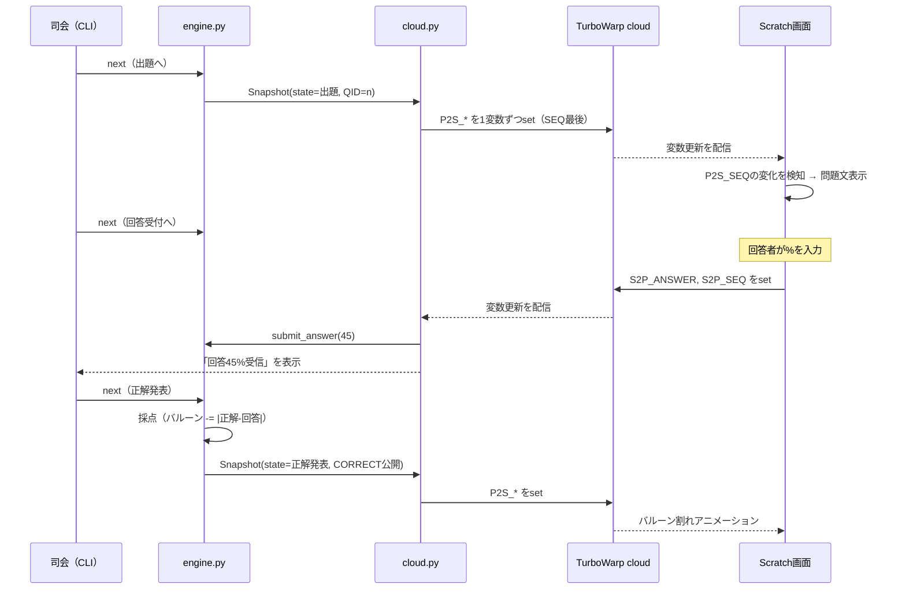

# アーキテクチャ

このドキュメントは、システム全体の構成と「なぜこの設計にしたか」を説明する。
初見の人はまずここを読めば全体像がわかる。

## このシステムは何か

高専祭ステージイベント「スズリーグ」（テレビ番組「ネプリーグ」の
「パーセントバルーン」ベースのクイズ）の進行を管理するシステム。

- ステージには**Scratchで作った画面**をプロジェクターで投影する（Scratch担当が開発）
- 司会補助が**PythonのCLIダッシュボード**を操作してゲームを進行する（このリポジトリ）
- 両者は**TurboWarpのクラウド変数**を介してリアルタイムに連携する

イベント自体の内容（ルール・タイムテーブル・台本）は
[イベント責任者作成の企画書](./イベント責任者作成の企画書.md) を参照。

## 全体構成

- **進行の主導権は常にPython側**にある。Scratch側は「表示装置＋回答入力装置」で、
  ステートを自分で進めることはない
- クラウド変数は「名前付きの数値を置くと接続中の全員に配信される共有黒板」。
  変数の意味づけ（プロトコル）は自前で定義している → [protocol.md](./protocol.md)

## 主要な設計判断とその理由

### 1. 通信基盤に TurboWarp cloud を採用（本家scratch.mit.eduではなく）

| | 本家 scratch.mit.edu | TurboWarp cloud（採用） |
|---|---|---|
| 書き込みに必要なもの | Scratchアカウントでログイン（New Scratcher不可） | 不要。URLを開くだけ |
| 変数の値 | 数値のみ・256桁まで | 数値のみ・10万文字まで |
| 値の永続性 | サーバに残る | **全員切断で消える**（インメモリ） |
| レート制限 | 変数セット間隔あり | セット間隔なし・IP単位の接続制限あり |

決め手は**観客のスマホ参加**（次フェーズ）。本家だと観客全員にScratchログインを
強いることになり現実的でない。値が消える欠点は、Python側から全状態を再送する
`resync` 機能でカバーする設計にした。

### 2. 生のクラウド変数 + 自前プロトコル（scratchattachのcloud requestsではなく）

scratchattachには「cloud requests」というRPC風フレームワークもあるが、
Scratchプロジェクト側に専用テンプレートの組み込みが必要で、Scratch担当の負担が大きい。
プロトタイプは「Scratch側は変数を読む/書くだけ」で済む生変数方式にした。
変数の一覧・意味は [protocol.md](./protocol.md) に固定してある。

### 3. 問題文はID参照方式

クラウド変数は数値しか送れず、日本語テキストのエンコードは重い。
そこで**問題文マスタはPython側**（`questions.py`）に持ち、Scratchへは問題IDのみ送る。
Scratch側は行番号=問題IDのリストを持ち、`uv run python -m suzuleague.questions` で
生成した貼り付け用テキストを取り込む。問題を差し替えたら双方の更新が必要な点に注意。

### 4. ダッシュボードはまずCLI

プロトタイプ重視の方針（最小構成でPython⇔Scratch間の通信を成立させる）に従い、
UIは後から差し替えられるようにロジックと分離した上でCLIを先行実装した。

### 5. 変数は1つずつ送信する（scratchattachのset_vars禁止）

scratchattachの一括送信 `set_vars()` は複数JSONを1つのWebSocketフレームに詰めるが、
TurboWarpサーバはこれを不正フレームとして無視し、**以降その接続からの送信を
すべて破棄する**（エラーは出ない。実測で確認済み）。そのため必ず `set_var()` で
1変数ずつ送る。詳細は [development.md の「既知の落とし穴」](./development.md#既知の落とし穴scratchattach--turbowarp) を参照。

## レイヤー構造

通信やUIを知らない純ロジック（engine）を中心に、依存が一方向になるよう分離している。

| モジュール | 責務 | 依存 |
|---|---|---|
| `models.py` | ドメインモデル（問題・チーム・ラウンド結果） | なし |
| `questions.py` | 問題セットのコード内管理、チームへの割り当て、Scratch貼り付け用エクスポート | models |
| `engine.py` | 進行ステートマシンと採点。**通信を一切知らない**のでオフラインでテスト可能 | models, questions |
| `protocol.py` | クラウド変数の名前と数値エンコード/デコード。通信ライブラリ非依存 | engine (Snapshot) |
| `cloud.py` | scratchattachによるTurboWarp cloud接続。状態push・回答受信・resync・heartbeat | protocol |
| `dashboard.py` | 司会が操作するCLI。engineを進め、変化をcloudへpushする | engine, cloud |
| `sim_scratch.py` | Scratch側のフリをする開発ツール。Scratch実装なしでE2E検証できる | cloud, questions |

この分離により：

- ゲームルールの変更・テストはネットワークなしで完結する（`tests/test_engine.py`）
- 将来ダッシュボードをWeb化するときも `engine.py` / `cloud.py` はそのまま使える
- 通信仕様の変更は `protocol.py` と `docs/protocol.md` の2箇所を直せばよい

## データフロー（1ラウンドの流れ）

## 制約・リスクと対応

| 制約 | 対応 |
|---|---|
| TurboWarp cloudは全員切断で値が消える | ダッシュボードの `resync` コマンドで全状態を再送できる |
| 同一IPからの接続頻度制限（実測: 連発すると1〜2分接続不可） | 本番・リハでは不要な再起動/リロードを避ける。復旧は待つだけ |
| Python停止＝進行不能 | Scratch側は `HEARTBEAT` 変数（15秒毎更新）で死活を検知できる |
| クラウド変数の更新を稀に取りこぼす可能性 | ステート遷移は司会の操作ペース（数秒単位）なので実害なし。SEQで検知も可能 |
| 観客数十人の同時接続上限（未検証） | 次フェーズで負荷検証。ダメならセルフホストcloudサーバ（scratchattach対応）に切替 |

## 今後のフェーズ（未実装）

1. **観客スマホ参加**: 観客がQRコード→TurboWarpのURLを開いて同じ問題に回答。
   回答の集計・ランキング。同時接続数の負荷検証が必要
2. **Firestore連携**: ランキングの永続記録が必要になった場合のみ導入
3. **本番問題の投入**: 企画書内リンクのアンケート集計スプレッドシートから
   `questions.py` の問題セットを差し替える
4. **本番ルームIDへの切替**: Scratch担当のリミックス完了後、
   環境変数 `SUZULEAGUE_PROJECT_ID` を新プロジェクトIDに設定
