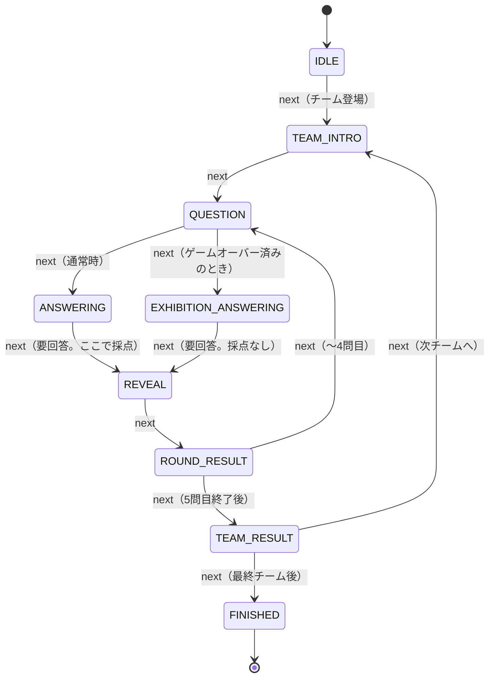

# ゲーム仕様とステートマシン

`engine.py` が実装しているゲームルールと進行ステートの正確な仕様。
企画書のルールをコードに落とし込んだ際の解釈・決定事項もここに記録する。

## ゲームルール

- **4チーム**が順番に挑戦する。1チームの持ち点は**バルーン100**
- 各チーム**5問**。「〜の割合は？」という問題に**パーセント（0〜100の整数）**で回答する
- 採点式: `バルーン残数 -= |正解% − 回答%|`（0未満にはならない）
- **バルーンが0になったらゲームオーバー**。そのチームの残りの問題は
  **エキシビション**（採点なしで出題・回答だけ行う）として消化する
  - 企画書の「クリアできなかったチームは、回答できなかった人にエキシビションマッチとして
    問題に参加していただきます」に対応
- 5問終了時にバルーンが1以上残っていれば**クリア**
- **優勝**: クリアしたチームのうちバルーン残数が最多のチーム
  （全チームゲームオーバーの場合は優勝なし）

### ぴったり賞（採否未確定）

回答が正解と完全一致したときにバルーンを加算するルール。
**元ネタのScratch作品（+10個）にはあるが企画書には記載がない**ため、
デフォルト無効のフラグとして実装してある。採用が決まったら
`uv run suzuleague --perfect-bonus 10` のように指定する。
（無効時もダメージ0にはなる。加算だけがフラグ制御）

## 進行ステート

ステートは9種類。値はそのままクラウド変数 `☁ P2S_STATE` として送信される
（[protocol.md](./protocol.md) と対応）。

| 値 | 名前 (`engine.State`) | 意味 | 司会の動き（想定） |
|---|---|---|---|
| 0 | `IDLE` | 待機（イベント開始前） | 開演前 |
| 1 | `TEAM_INTRO` | チーム紹介 | チーム登場・インタビュー |
| 2 | `QUESTION` | 出題 | 問題文の読み上げ |
| 3 | `ANSWERING` | 回答受付 | シンキングタイム（20秒） |
| 4 | `REVEAL` | 正解発表 | 「正解は〇〇%！」バルーン割れ演出 |
| 5 | `ROUND_RESULT` | ラウンド結果 | バルーン残数の確認 |
| 6 | `TEAM_RESULT` | チーム結果 | クリア/ゲームオーバー演出・インタビュー |
| 7 | `EXHIBITION_ANSWERING` | 回答受付（エキシビション） | 3と同じだが採点なし |
| 8 | `FINISHED` | 全体結果 | 表彰式 |

### 遷移図

すべての遷移はダッシュボードの `next` 操作で起こる（自動遷移はない）。

### 遷移のルール（実装上の決定事項）

- **回答がないと正解発表に進めない**: `ANSWERING` / `EXHIBITION_ANSWERING` で
  回答未提出のまま `next` すると `GameError`（司会のミス防止）
- **回答は上書き可能**: 回答受付中に複数回回答が来たら最後のものが有効。
  確定タイミングは `next`（正解発表への遷移）時
- **採点は `REVEAL` への遷移時に1回だけ**行われる
- **エキシビション判定は出題ごと**: `QUESTION` から回答受付に進む時点で
  チームがゲームオーバー済みなら `EXHIBITION_ANSWERING` になる。
  次のチームに移れば通常モードに戻る
- **正解%の隠蔽**: Snapshot（=Scratchに送る状態）の `correct` は
  `REVEAL` と `ROUND_RESULT` のときだけ実際の値になり、それ以外は `-1`。
  出題中にScratch側から正解が見えることはない
- 回答の入力元は問わない: Scratchのクラウド変数経由でも、
  ダッシュボードの `answer` コマンドでも同じ扱い（本番でどちらに寄せるかは未定）

## 問題セット

- 問題は `questions.py` にコードで定義（`Question(id, text, correct, source)`）
- **問題ID = 通し番号**で、チームtのラウンドr（どちらも1始まり）の問題IDは
  `(t-1)*5 + r`。つまりチーム1がID 1〜5、チーム2がID 6〜10…と固定割り当て
- 現在入っているのは**プロトタイプ用のサンプル20問**。本番はアンケート集計
  スプレッドシート（企画書内リンク）の結果から差し替える
- 問題文テキストはScratch側にも表示用リストとして持たせる（ID参照方式）。
  貼り付け用テキストの生成: `uv run python -m suzuleague.questions > questions.txt`

## 具体例: 1チームの進行と採点

正解が `62, 48, 35, 55, 28`（サンプル問題チーム1）で、毎回 `40%` と回答した場合:

| 問 | 正解 | 回答 | ダメージ | バルーン残 |
|---|---|---|---|---|
| 1 | 62 | 40 | 22 | 78 |
| 2 | 48 | 40 | 8 | 70 |
| 3 | 35 | 40 | 5 | 65 |
| 4 | 55 | 40 | 15 | 50 |
| 5 | 28 | 40 | 12 | **38 → クリア** |

（この例はそのままE2Eテストの期待値として使っている）
