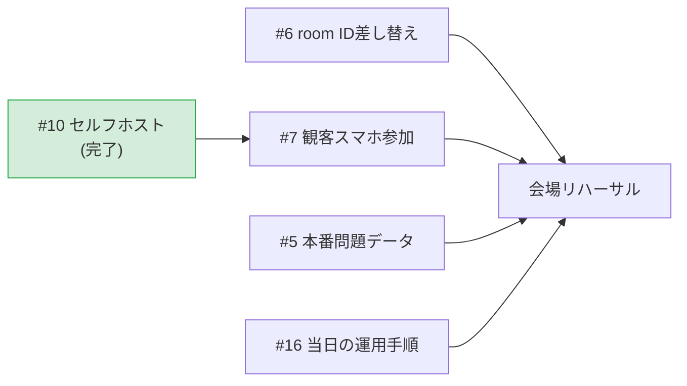

# 進捗状況（2026-07-23 時点）

このドキュメントは**今どこまで進んでいて、次に何をすべきか**を1枚で把握するためのもの。
設計の説明は [architecture.md](./architecture.md)、開発手順は [development.md](./development.md) を参照。

課題の全量と最新状況は
[GitHub Issues](https://github.com/suzuka-kosen-festa/snctfes2026-suzuleague/issues)
で管理している。このドキュメントは節目ごとの棚卸しとして更新する。

技術的な背景を知らない人には
[しくみの図解](https://htmlpreview.github.io/?https://github.com/suzuka-kosen-festa/snctfes2026-suzuleague/blob/main/docs/explainer.html)
（[docs/explainer.html](./explainer.html)）を先に渡すとよい。

## スケジュール

| 項目 | 日付 |
|---|---|
| 本番 | 2026/10/31（土）〜11/1（日） |
| **完成目標** | **2026/08/31** |
| 現在 | 2026/07/23（完成目標まで約6週間） |

イベント時間は40分、準備10分。参加者は4チーム・現時点で計15人。

## 全体の進捗

```
バックエンド中核（進行・採点・通信）  ████████████████████ 完了
通信基盤（セルフホストサーバ）        ████████████████████ 完了・稼働中
本番データの投入                      ░░░░░░░░░░░░░░░░░░░░ 未着手
観客スマホ参加                        ░░░░░░░░░░░░░░░░░░░░ 未着手（着手可能に）
Scratch側との結合                     ████░░░░░░░░░░░░░░░░ Scratch側が実装中
```

Python側は**本番同等の通信経路が実サーバ上で動く**ところまで完成している。
残りは「本物のデータを入れる」「観客参加を作る」「Scratch側と繋ぐ」の3つ。

## 完了していること

### バックエンドの中核

| モジュール | 状態 |
|---|---|
| `engine.py` 進行ステートマシン・採点 | ✅ 9ステート実装。通信非依存でテスト可能 |
| `protocol.py` クラウド変数の規約 | ✅ P2S 7変数 + S2P 3変数を定義 |
| `cloud.py` cloud接続 | ✅ 状態push・回答受信・resync・heartbeat |
| `dashboard.py` 司会用CLI | ✅ next/answer/status/teams/resync |
| `questions.py` 問題セット | ⚠️ 動作するがサンプル問題のまま |
| `sim_scratch.py` Scratch側シミュレータ | ✅ Scratch実装なしでE2E検証できる |
| 接続先サーバの切り替え | ✅ `--cloud-host` / `SUZULEAGUE_CLOUD_HOST` で差し替え可能 |
| `loadtest.py` 負荷検証 | ✅ 接続数と配信到達率・遅延を実測できる |
| テスト | ✅ 46件パス（ネットワーク不要・1秒未満） |

### 通信基盤（#4 → #10）

公開サーバの上限を実測し、**セルフホストのサーバを本番稼働させるところまで完了**した。

- 公開サーバは**1部屋128クライアントが上限**で、**超過分は静かに失敗する**
  （WebSocketは繋がるのに変数が届かず、クライアント側にエラーが出ない）
- セルフホスト先は **Render の無料枠**。費用は0円
- 本番の接続先: **`wss://suzuleague-cloud.onrender.com`**（Singapore・`MAX_CLIENTS=300`）
- **150接続まで全員に配信が届くことを実測済み**（遅延約120ms。公開サーバ経由の266msより速い）
- cloud-server 本体に**IP単位の制限は実装されていない**ことをソースで確認。
  会場Wi-Fiで観客が同一グローバルIPに集約されても問題にならない

詳細は [architecture.md](./architecture.md#同時接続数の上限とセルフホスト方針)。

### 確定したルール・方針

- **ぴったり賞は不採用**（2026-07-23）。実装はフラグとして残すが本番では
  `--perfect-bonus` を付けない。詳細は [game-rules.md](./game-rules.md#ぴったり賞不採用2026-07-23決定)
- **サーバ費用は0円で組む**（2026-07-23）。企画書に予算枠がないため経費申請もしない
- **観客スマホ参加は本番スコープに含む**（企画書の内容・司会台本に組み込み済み）

### リポジトリの整備

- ドキュメント一式（architecture / protocol / development / game-rules / status）
- 非技術者向けの [しくみの図解](./explainer.html)
- Org `suzuka-kosen-festa` へ移管（2026-07-22）

## 残っているタスク

| 優先度 | Issue | 内容 | 状態 |
|---|---|---|---|
| **P0** | [#6](https://github.com/suzuka-kosen-festa/snctfes2026-suzuleague/issues/6) | Scratch 本番プロジェクトの room ID を差し替える | **Scratch側が実装中・ID待ち** |
| **P0** | [#16](https://github.com/suzuka-kosen-festa/snctfes2026-suzuleague/issues/16) | 本番当日の運用手順を整備する | 一部着手可能 |
| **P1** | [#5](https://github.com/suzuka-kosen-festa/snctfes2026-suzuleague/issues/5) | 本番問題データの作成 | **今すぐ着手可能** |
| **P1** | [#7](https://github.com/suzuka-kosen-festa/snctfes2026-suzuleague/issues/7) | 観客スマホ参加の集計と Firestore 連携 | **ブロック解除・着手可能** |
| P2 | [#8](https://github.com/suzuka-kosen-festa/snctfes2026-suzuleague/issues/8) | Renovate の導入方針 | 本番に影響なし |

依存関係:



## 進め方の方針

**#10 が終わったことで、他人待ちのタスクは #6 だけになった。**

1. #6 を Scratch 担当に依頼する（プロジェクトIDは実装完了前でももらえる。
   本番URLの形も確定したので同時に伝える）
2. #5 の問題データ作成を進める（ブロッカーなし。アンケート回答は既に集まっている）
3. #7 の観客スマホ参加に着手する（#10 の完了でブロックが外れた）

## 未解決の論点

判断が必要で、まだ決まっていないもの。

| 論点 | 状況 |
|---|---|
| 観客の想定人数 | クラス委員4人で勧誘する規模を要確認。150接続までは実測済みなので、それを超えるなら追加検証が要る |
| 挑戦者の画面を観客に見せない方法 | 企画書に「参加者がスマホ画面を見ちゃうので対策考えておくこと」との宿題あり。#7 の設計に影響 |
| Render 無料枠の残量 | アカウント全体で月750時間の共有。既存サービスが2つある。本番月（10月）に要確認（#16） |

## リスク

| リスク | 影響 | 対応 |
|---|---|---|
| Scratch 側が実装中（2026-07-23時点で「通信で操作できるように加工中」） | 結合テストの時期が読めない | シミュレータで先行検証済み。完了予定日を Scratch担当に確認する |
| 会場ネットワークの品質 | 観客参加が成立しない | 会場でのリハーサルが必須。IP制限のないセルフホストに切り替え済み |
| cloud サーバの単一障害点 | サーバが落ちるとイベント進行が止まる | 司会CLIの `answer` コマンドで代行入力でき、最低限の進行は継続できる。バックアップ手順は #16 |
| Render 無料枠のスピンダウン（15分無通信で停止。**実測で17分放置→復帰に22.8秒**） | 開演直後にサーバが応答しない | ダッシュボードの HEARTBEAT が15秒毎に流れるので稼働中は落ちない。**開演30分前に必ず起こす**（#16） |
| 観客数が `MAX_CLIENTS` を超える | 超過分の観客が静かに脱落する | 300に設定済み。150までは実測で確認。サーバログで `Too many clients` を監視できる |

## 運用ルール

- 技術的な詰まり・仕様変更は **Discord で即時相談**する
- 通信仕様を変えたら `protocol.py` と `docs/protocol.md` を同時に更新し、
  **Scratch担当に必ず連絡**する（[手順](./development.md#通信仕様を変更するとき)）
- 本番投入前の確認事項は
  [リリースチェックリスト](./development.md#リリース本番投入チェックリスト) を参照
