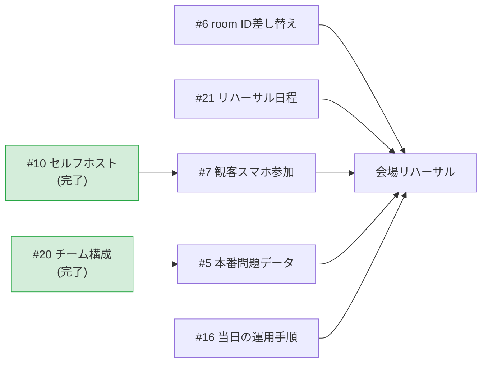

# 進捗状況（2026-07-24 時点）

このドキュメントは**今どこまで進んでいて、次に何をすべきか**を1枚で把握するためのもの。
設計の説明は [architecture.md](./architecture.md)、開発手順は [development.md](./development.md) を参照。

課題の全量と最新状況は
[GitHub Issues](https://github.com/suzuka-kosen-festa/snctfes2026-suzuleague/issues)
で管理している。このドキュメントは節目ごとの棚卸しとして更新する。

技術的な背景を知らない人には
[しくみの図解](https://htmlpreview.github.io/?https://github.com/suzuka-kosen-festa/snctfes2026-suzuleague/blob/main/docs/explainer.html)
（[docs/explainer.html](./explainer.html)）を先に渡すとよい。

## スケジュール

| 項目 | 日付 |
|---|---|
| 本番 | 2026/10/31（土）〜11/1（日） |
| **完成目標** | **2026/08/31** |
| 現在 | 2026/07/24（完成目標まで約5週間） |

イベント時間は40分、準備10分。参加者は4チーム・現時点で計15人。

## 全体の進捗

```
バックエンド中核（進行・採点・通信）  ████████████████████ 完了
通信基盤（セルフホストサーバ）        ████████████████████ 完了・稼働中
ゲームルールの確定                    ████████████████████ 完了（2026-07-24）
本番データの投入                      ████████████████░░░░ Python側完了・Scratch取込待ち
観客スマホ参加                        ████████████████░░░░ 実装・デプロイ済み・実機確認待ち
Scratch側との結合                     ░░░░░░░░░░░░░░░░░░░░ 未着手・Scratch側が実装中
当日の運営体制                        ████░░░░░░░░░░░░░░░░ 手順書はある・操作者が未定
```

**Python側の実装は出そろった。** 残っているのは他者の成果物との結合と実地確認で、
コードを書く作業ではない。

いちばんの未知数は**Scratch側との結合テスト**。今までの動作確認はすべて
自作のシミュレータ相手なので、実物と繋ぐまで何が起きるか分からない
（[詳しくは architecture.md](./architecture.md#結合テストがなぜ最大の未知数か)）。

## 完了していること

### バックエンドの中核

| モジュール | 状態 |
|---|---|
| `engine.py` 進行ステートマシン・採点 | ✅ 9ステート実装。通信非依存でテスト可能 |
| `protocol.py` クラウド変数の規約 | ✅ P2S 7変数 + S2P 3変数を定義 |
| `cloud.py` cloud接続 | ✅ 状態push・回答受信・resync・heartbeat |
| `dashboard.py` 司会用CLI | ✅ next/answer/status/teams/resync |
| `questions.py` 問題セット | ✅ **本番問題20問を投入済み**（アンケート2種の集計結果） |
| `sim_scratch.py` Scratch側シミュレータ | ✅ Scratch実装なしでE2E検証できる |
| 接続先サーバの切り替え | ✅ `--cloud-host` / `SUZULEAGUE_CLOUD_HOST` で差し替え可能 |
| `teams.py` チーム構成 | ✅ 名前・メンバー・登場順をJSONで差し替え可能（個人情報はリポジトリに置かない） |
| `audience.py` 観客用ページ | ✅ **生成・デプロイ済み**（端末内で自己採点する方式） |
| `loadtest.py` 負荷検証 | ✅ 接続数と配信到達率・遅延を実測できる |
| テスト | ✅ **66件パス**（ネットワーク不要・0.2秒） |

### 通信基盤（#4 → #10）

公開サーバの上限を実測し、**セルフホストのサーバを本番稼働させるところまで完了**した。

- 公開サーバは**1部屋128クライアントが上限**で、**超過分は静かに失敗する**
  （WebSocketは繋がるのに変数が届かず、クライアント側にエラーが出ない）
- セルフホスト先は **Render の無料枠**。費用は0円
- 本番の接続先: **`wss://suzuleague-cloud.onrender.com`**（Singapore・`MAX_CLIENTS=300`）
- **150接続まで全員に配信が届くことを実測済み**（遅延約120ms。公開サーバ経由の266msより速い）
- cloud-server 本体に**IP単位の制限は実装されていない**ことをソースで確認。
  会場Wi-Fiで観客が同一グローバルIPに集約されても問題にならない

詳細は [architecture.md](./architecture.md#同時接続数の上限とセルフホスト方針)。

### 確定したルール・方針

- **ぴったり賞は不採用**（2026-07-23）。実装はフラグとして残すが本番では
  `--perfect-bonus` を付けない。詳細は [game-rules.md](./game-rules.md#ぴったり賞不採用2026-07-23決定)
- **サーバ費用は0円で組む**（2026-07-23）。企画書に予算枠がないため経費申請もしない
- **観客スマホ参加は本番スコープに含む**（企画書の内容・司会台本に組み込み済み）。
  観客の回答は**端末内で自己採点**し、サーバへは送らない方式で実装済み
- **本番まで依存を更新しない**（2026-07-23）。とくに scratchattach は
  既知の落とし穴を 2.2.1 で実測しているため更新しない。Renovate は導入しない（#8）

### リポジトリの整備

- ドキュメント一式（architecture / protocol / development / game-rules / status）
- 非技術者向けの [しくみの図解](./explainer.html)
- Org `suzuka-kosen-festa` へ移管（2026-07-22）

## 残っているタスク

「誰の手を止めるか」で3つに分けている。**返事待ちになるものを先に投げ、
待つ間に自分で完結する作業を進める**のが基本方針。

### A. 先に投げる（他人の返事が要る・投げるだけなら数分）

| 優先度 | Issue | 内容 | 投げる先 |
|---|---|---|---|
| **P0** | [#6](https://github.com/suzuka-kosen-festa/snctfes2026-suzuleague/issues/6) | Scratch 本番プロジェクトの room ID | Scratch担当 |
| **P1** | [#21](https://github.com/suzuka-kosen-festa/snctfes2026-suzuleague/issues/21) | リハーサルの日程と当日の運営体制 | イベント責任者・音響 |

**残るブロッカーは Scratch側の実装だけ**になった。#6 の room ID が来れば
本番の接続先に切り替えられる。#21 は会場と音響の都合があるので早く押さえたい。

解決済み:

- [#20](https://github.com/suzuka-kosen-festa/snctfes2026-suzuleague/issues/20)
  チーム構成 → **5問固定・司会が回答者を指名する**運用に決定（2026-07-24）。
  実装変更は不要だった。チーム名は仮のまま進め、決まり次第JSONで差し替える
- [#19](https://github.com/suzuka-kosen-festa/snctfes2026-suzuleague/issues/19)
  個人情報 → 伏字化とprivate化の依頼提出をもってクローズ。ただし
  **git履歴には元の記載が残っている**ため、private化の反映は別途確認する

### B. 自分で進める（ブロッカーなし）

現時点で自分だけで完結する大物は残っていない。以下は他者の返事が来てから動く。

- [#5](https://github.com/suzuka-kosen-festa/snctfes2026-suzuleague/issues/5) 本番問題データ:
  **Python側は投入完了**。Scratch側の表示リストへの取り込みが残っている
  （`uv run python -m suzuleague.questions` の出力をScratch担当に渡す）
- [#7](https://github.com/suzuka-kosen-festa/snctfes2026-suzuleague/issues/7) 観客スマホ参加:
  **観客用ページを実装・デプロイ済み**（<https://suzuleague-cloud.onrender.com/suzuleague.html>）。
  実機での確認と、QRコードの発行が残っている

### C. 期日が来たらやる

| 優先度 | Issue | 内容 | いつ |
|---|---|---|---|
| P0 | [#16](https://github.com/suzuka-kosen-festa/snctfes2026-suzuleague/issues/16) | Render 無料枠の残量確認 | 2026年10月 |

依存関係:



## 進め方の方針

Python側の実装は出尽くしたので、**残りは「投げて待つ」フェーズ**に入っている。

1. **A のIssueを投げる**（#6・#21）。所要は合計15分程度
2. Scratch側の実装が上がってきたら**結合テスト**。ここが最大の未知数で、
   8月末完成を守れるかはこのタイミング次第
3. 会場リハーサルで実機・実ネットワークの確認

## 未解決の論点

判断が必要で、まだ決まっていないもの。

| 論点 | 状況 |
|---|---|
| 挑戦者の画面を観客に見せない方法 | 企画書の宿題。**回答受付中は集計を出さない**案が有力（#7 のコメント参照）。企画側の合意が要る |
| 観客の想定人数 | クラス委員4人で勧誘する規模を要確認。150接続までは実測済みなので、それを超えるなら追加検証が要る |
| 当日ダッシュボードを操作するのは誰か | 企画書の人員表にシステム担当の記載がない。司会2人は台本で手が塞がる（#21） |
| Render 無料枠の残量 | アカウント全体で月750時間の共有。既存サービスが2つある。本番月（10月）に要確認（#16） |

## リスク

| リスク | 影響 | 対応 |
|---|---|---|
| **Scratch 側の実装状況が分からない**（2026-07-23時点で「通信で操作できるように加工中」） | 結合テストの時期が読めず、8月末完成が守れるか判断できない | 完了予定日を Scratch担当に確認する（#6 の連絡に含めた）。シミュレータでの先行検証は済んでいるが、**それは実物と繋がる保証にはならない** |
| 結合時に無言の不具合が出る（変数名の綴り違い・型・順序） | 原因究明に時間を取られる | 出やすいパターンを [protocol.md](./protocol.md#繋いだときに出やすい不具合) に一覧化して先に共有した |
| 会場ネットワークの品質 | 観客参加が成立しない | 会場でのリハーサルが必須。IP制限のないセルフホストに切り替え済み |
| cloud サーバの単一障害点 | サーバが落ちるとイベント進行が止まる | 司会CLIの `answer` コマンドで代行入力できる。加えて**司会PC上でサーバを動かす手順を実地で確認済み**（[手順](./development.md#本番サーバが落ちたときの代替手段)） |
| Render 無料枠のスピンダウン（15分無通信で停止。**実測で17分放置→復帰に22.8秒**） | 開演直後にサーバが応答しない | **HEARTBEATを17分送り続けても眠らないことを実測済み**（応答0.43秒）。稼働中は落ちない。**開演30分前に必ず起こす**（#16） |
| 観客数が `MAX_CLIENTS` を超える | 超過分の観客が静かに脱落する | 300に設定済み。150までは実測で確認。サーバログで `Too many clients` を監視できる |

## 運用ルール

- 技術的な詰まり・仕様変更は **Discord で即時相談**する
- 通信仕様を変えたら `protocol.py` と `docs/protocol.md` を同時に更新し、
  **Scratch担当に必ず連絡**する（[手順](./development.md#通信仕様を変更するとき)）
- 本番投入前の確認事項は
  [リリースチェックリスト](./development.md#リリース本番投入チェックリスト) を参照
